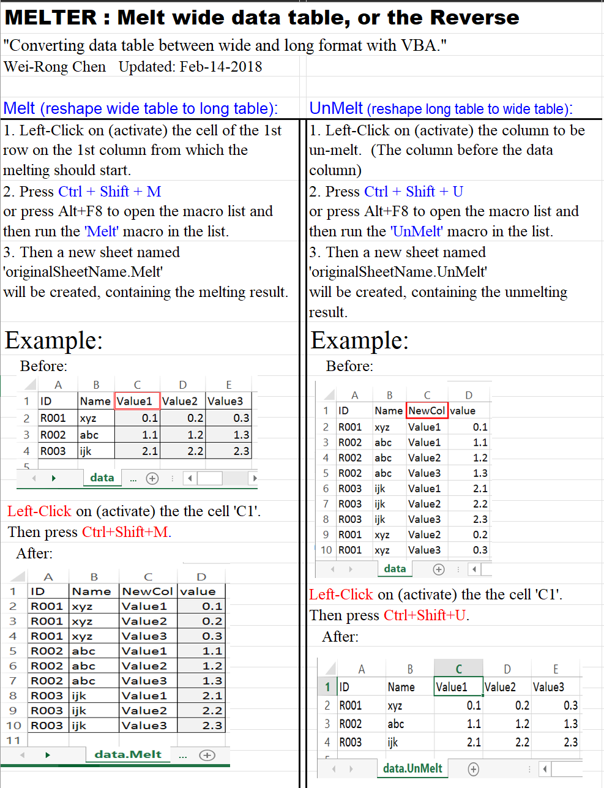

# MELTER
Melt wide data table, or the reverse
### Converting data table between wide and long format with VBA
Excel VBA (Visual Basic for Applications)

See the "Instruction" sheet in 'MELTER.xlsm'

### COPYRIGHT, LICENSE & DISCLAIMER
Copyright (C) 2020 Wei-Rong Chen <wei-rong.chen[AT]yale.edu>  
This program is free software under GNU General Public License, version 3.  
This program is distributed WITHOUT ANY FORM of EXPRESS or IMPLIED WARRANTY and ANY SUPPORT.    
See the GNU General Public License for more details.  
